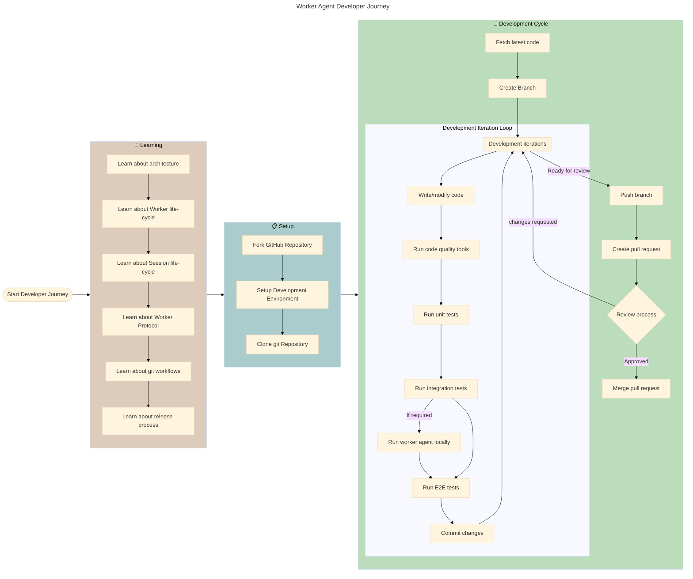

# AWS Deadline Cloud Worker Agent Developer Documentation

This page provides guided documentation for development of the AWS Deadline Cloud worker agent.
The following diagram illustrates the journey recommended for a new developer onboarding to worker
agent development.

This directory contains comprehensive documentation for developers working on the AWS Deadline Cloud Worker Agent. The documentation is organized to provide a clear understanding of the worker agent's architecture, development processes, and technical details.

## Learning

If you're new to the project, we recommend starting with these documents:

* [Architecture](architecture.md) - Overview of the worker agent architecture and components
* [Worker Lifecycle](worker_lifecycle.md) - Detailed explanation of the worker agent's lifecycle
* [Session Lifecycle](session_lifecycle.md) - Comprehensive overview of how sessions are executed
* [Worker API Protocol](worker_api_protocol.md) - Documentation of the API interactions with the Deadline Cloud service
* [GitHub Workflows](github_workflows.md) - CI/CD pipelines and GitHub Actions configuration
* [Release Process](release_process.md) - Information about the release workflow and versioning strategy

## Setup

See [Development Environment Setup](development_environment_setup.md) for guidance on setting up
your development environment

## Development Processes

These documents cover the development workflows and processes:

- [Developer Workflows](developer_workflows.md) - Common development tasks and procedures
