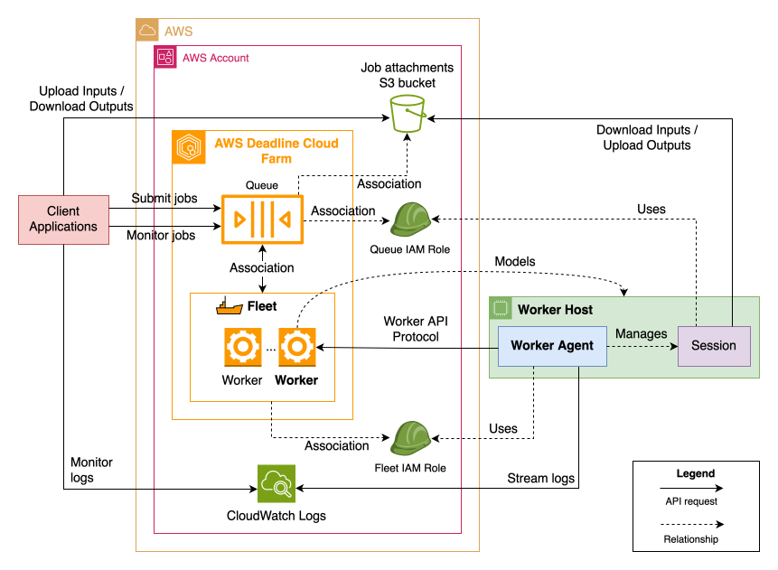
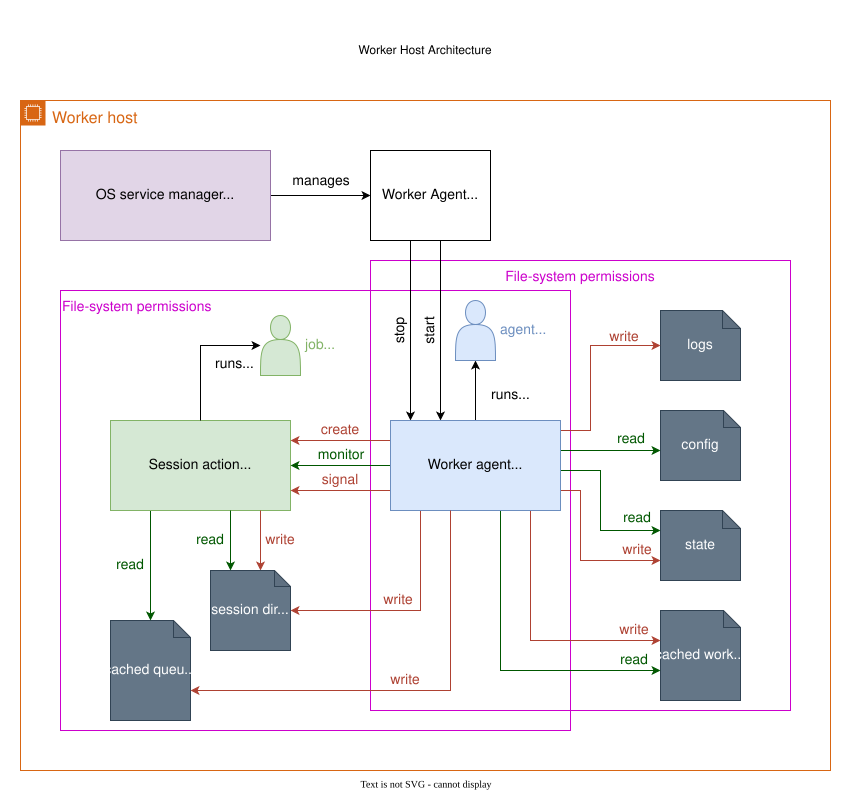
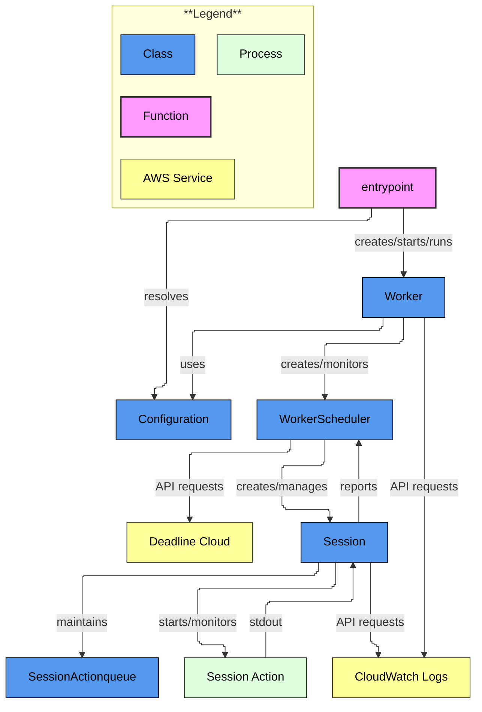
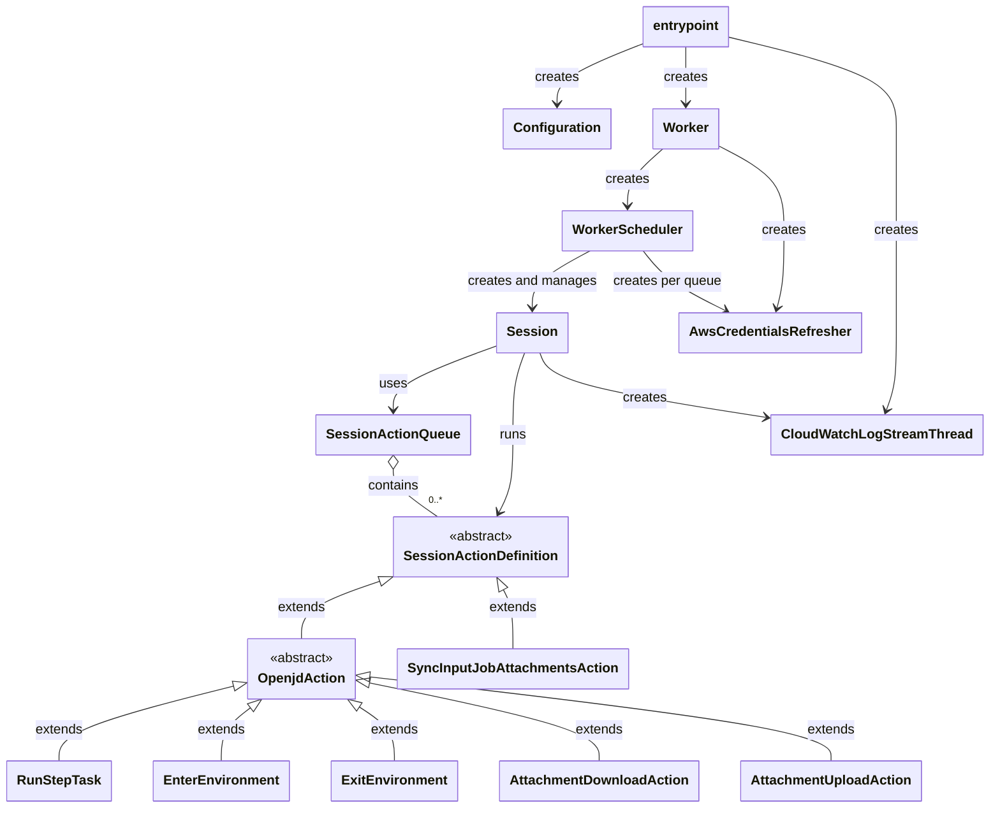
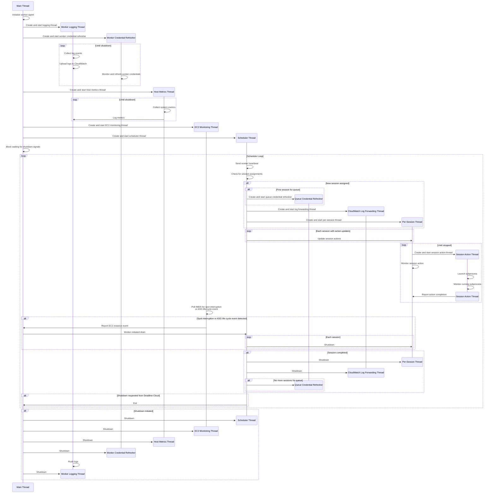

# Worker Agent Architecture

This guide provides developers with a comprehensive overview of the worker agent's architecture, and a breakdown of its components, and the execution model. Whether you're fixing bugs, adding features, or improving performance, understanding the core concepts outlined here will help you understand the architecture of the project.

**Outline:**

*  [1. High-Level Architecture](#1-high-level-architecture)
   *  [1.1. Responsibilities](#11-responsibilities)
*  [2. Worker Host Architecture](#2-worker-host-architecture)
    *  [2.1. Worker Agent Installation](#21-worker-agent-installation)
    *  [2.2. Operating System Users and Groups](#22-operating-system-users-and-groups)
    *  [2.3. File System Structure](#23-file-system-structure)
    *  [2.4. Security Boundaries](#24-security-boundaries)
    *  [2.5. Process Model](#25-process-model)
    *  [2.6. Operating System Services](#26-operating-system-services)
*  [3. Software Architecture](#3-software-architecture)
   *  [3.1. Class Diagram](#31-class-diagram)
*  [4. Code Organization](#4-code-organization)
   *  [4.1. Key Files](#41-key-files)
*  [5. Thread Model and Concurrency](#5-thread-model-and-concurrency)
   *  [5.1. Thread Lifecycle Diagram](#51-thread-lifecycle-diagram)
   *  [5.2. Concurrency Control and Locks](#52-concurrency-control-and-locks)
      *  [5.2.1. Lock Acquisition Order](#521-lock-acquisition-order)

## 1. High-Level Architecture

The AWS Deadline Cloud Worker Agent is a critical component of AWS Deadline Cloud, responsible for running jobs on worker hosts. The diagram below illustrates where the worker agent fits in the larger AWS Deadline Cloud architecture:

  
<small>*Diagram can be edited using draw.io*</small>

The architecture consists of several key components/concepts:

*   **AWS Deadline Cloud Service** &mdash; The central service that manages job scheduling and worker coordination

*   **Worker Host** &mdash; A compute host machine modeled by a worker resource in Deadline Cloud.
    See the [worker host architecture](#12-worker-host-architecture) section for more details.

*   **Worker Agent** &mdash; A software component that runs on worker hosts. The worker agent communicates with the Deadline Cloud service using the [Worker API Protocol](./worker_api_protocol.md) and is responsible for managing the [worker life-cycle](./worker_lifecycle.md), the [session life-cycle](./session_lifecycle.md) for assigned worker sessions, and reporting the progres/status of the ongoing sessions back to Deadline Cloud.

*   **Session** &mdash; A stateful context maintained by workers where work for the submitted jobs are ran. The worker agent runs an extension of
    [Open Description (OpenJD)][openjd] sessions specific to AWS Deadline Cloud.

[openjd]: https://github.com/OpenJobDescription/openjd-specifications/wiki

*   **Fleet** &mdash; A group of workers with similar host characteristics (e.g. operating system, compute resources, pre-installed software, etc&hellip;)

    There are two different types of fleets in Deadline Cloud:

    *   **Customer-Managed Fleet (CMF)** &mdash; Worker hosts managed by customers, running the worker agent software. These fleets can be located in EC2, on-premise, or in a co-located data center.

    *   **Service-Managed Fleet (SMF)** &mdash; Worker hosts managed by the Deadline Cloud service, with the worker agent pre-installed.

*   **Client Applications** &mdash; Software that interfaces with AWS Deadline Cloud APIs to submit/monitor/manage jobs and to download their outputs. Some examples include the Deadline Cloud monitor and the Deadline command-line interface. In general, this can include any application that interacts with the Deadline Cloud APIs.

*   **Additional AWS Services**

    *   **CloudWatch Logs** &mdash; Used to stream the worker agent application logs and session logs for remote monitoring.

    *   **S3** &mdash; Used to transfer [job attachments][job-attachments] between client applications and workers

[job-attachments]: https://docs.aws.amazon.com/deadline-cloud/latest/userguide/storage-job-attachments.html

### 1.1. Responsibilities

The AWS Deadline Cloud Worker Agent has the following key responsibilities:

-   **Worker Management**:
    -   Maintain the worker through its [life-cycle](./worker_lifecycle.md)
    -   Create a worker resource in Deadline Cloud if required
    -   Maintain the worker status and keep the worker's schedule in sync with Deadline Cloud by
        following the [Worker API protocol](./worker_api_protocol.md). This protocol defines the required behavior of any worker agent implementation.
    -   Handle graceful shutdown and interruption scenarios

-   **Session Management**:
    -   Maintain the session through its [life-cycle](./session_lifecycle.md) for all assigned sessions
    -   Establish new sessions assigned by Deadline Cloud
    -   Run the actions in the order assigned by Deadline Cloud
    -   Report session status and progress back to the service
    -   Handle session action failures and interruptions

-   **Security and Authentication**:
    -   Retrieve and rotate temporary worker and queue AWS credentials
    -   Provide secure access of the assumed queue role to sessions for the queue
    -   Maintain least-privilege access of files and directories involved
    -   Uphold security boundaries between
        -   the worker agent and sessions
        -   sessions for jobs in different queues

-   **Host Monitoring**:
    -   Track host metrics (CPU, memory, disk usage)
    -   Monitor for EC2 spot interruptions, ASG lifecycle events, and operating system
        signals sent to the process

-   **Logging**:
    -   Stream worker agent logs to CloudWatch Logs
    -   Capture session output and stream to CloudWatch logs

## 2. Worker Host Architecture

The worker host is the compute environment where the worker agent runs jobs. This section details the key aspects of the worker host architecture.

  
<small>*Diagram can be edited using draw.io*</small>

The type of host machine is abstract. Examples of worker hosts include:

*   EC2 instances
*   physical on-premise servers
*   virtual machines
*   containers

### 2.1. Worker Agent Installation

The installation of the worker agent is a two step process. First, the Python package must be
downloaded. An example for this using `pip`:

```sh
pip install deadline-cloud-worker-agent
```

After the Python package is installed, the worker agent installer can be run to complete the setup.
The Python package provides a `install-deadline-worker` command-line entrypoint for this purpose.
To learn about the available arguments, run:

```sh
install-deadline-worker --help
```

The `install-deadline-worker` program:

- Creates necessary directories and file structures required by the worker agent at run-time
- Creates required operating system users and groups
- Sets up required file-system permissions and ownership
- Grants the required operating system user privileges
- Sets up operating system services for automatic startup and crash recovery

### 2.2. Operating System Users and Groups

-   **Agent User**:
    -   Dedicated system user that the worker agent process runs as
    -   Defaults to `deadline-worker-agent` on Linux and `deadline-worker` on Windows
    -   Limited privileges following the principle of least privilege
    -   No login shell access for security

-   **Job Users**:
    -   Queues can specify a "job run as user" that jobs will run as
    -   The worker host admin can configure this user's permissions on the worker host as required
    -   Enables separate user contexts for jobs from different queues
    -   The job user's primary group is used for managing file-system access to an individual queue job user
    -   See [Create job users and groups](https://docs.aws.amazon.com/deadline-cloud/latest/developerguide/worker-host.html#create-job-user-and-group) for more information

-   **User Groups**:
    -   User group that all job users belong to. Used for controlling access to file-system directories accessible by all job users. Defaults to `deadline-job-users`.

### 2.3. File System Structure

The worker agent uses several directories for configuration, state management, and running sessions. This section details the purpose and security characteristics of each location.

#### 2.3.1. Configuration Directory

See the [Configuration documentation](../configuration.md).

-   **Purpose**: Contains the `worker.toml` configuration file that informs worker agent behavior
-   **Created**: During installation, when running `install-deadline-worker`
-   **Access**:
    -   Read by worker agent user
    -   Written by worker host administrator during installation or for manual configuration

#### 2.3.2. Persistence/Cache Directory

See [State documentation](../state.md).

-   **Purpose**: Stores worker identity, and worker AWS credentials for persistence across worker agent program restarts. Also used for providing queue AWS credentials to session action subprocesses.
-   **Created**:
    -   State directory: During installation, when running `install-deadline-worker`
    -   `worker.json`: At run-time, during the [worker startup phase](./worker_lifecycle.md#startup-phase)
    -   `credentials/<WORKER_ID>.json`: At run-time, during the [worker startup phase](./worker_lifecycle.md#startup-phase)
    -   `queues/<QUEUE_ID>/`: Created when starting sessions
-   **Key Files**:
    -   `worker.json`: Worker state file with worker ID and instance ID
    -   `credentials/<WORKER_ID>.json`: Worker AWS credentials
    -   `queues/<QUEUE_ID>/`: Queue-specific credentials and configuration
-   **Access**:
    -   `worker.json`: Read/written by worker agent process
    -   `credentials/<WORKER_ID>.json`: Read/written by worker agent only
    -   `queues/<QUEUE_ID>/`: Written by worker agent and read by job users in session actions

#### 2.3.3. Session Directories

See [session directory documentation](../state.md#session-directories).

-   **Purpose**: Contains temporary working context files and job attachments for running worker sessions
-   **Created**: 
    -   Root directory: During installation, when running `install-deadline-worker`
    -   Individual session directories: At runtime when sessions are assigned
-   **Access**:
    -   Root directory: Read/written by worker agent and read by job users
    -   Individual session directories: Read/written by worker agent and read/write by associated job user

#### 2.3.4. Log Files

See [Logging documentation](../logging.md).

-   **Purpose**: Records worker agent and session activity for monitoring and troubleshooting
-   **Created**:
    -   Logging directory: During installation, when running `install-deadline-worker`
    -   Agent log file: At run-time, during the [worker startup phase](./worker_lifecycle.md#startup-phase)
    -   Session log files: At run-time, when sessions are started.
-   **Access**:
    -   Written by worker agent process
    -   Read by worker host administrators

### 2.4. Security Boundaries

-   The worker agent runs as the agent user which has access to:
    -   The worker AWS credentials providing access to Deadline Cloud worker APIs
    -   Run processes as the job users
-   The worker agent runs session actions as subprocesses running as the job user
-   The job user does not need access to the worker AWS credentials or Deadline Cloud APIs
-   The job user does not need to run processes as other users
-   The job user for a specific queue has access to:
    -   Session directories created for that queue
    -   The queue's AWS credentials
-   Permissions are setup such that job users from one queue will not have access to
    session directories or queue credentials for another queue's job user

See the ["worker host" section](https://docs.aws.amazon.com/deadline-cloud/latest/userguide/security-best-practices.html#worker-hosts) of the "Security Best Practices" topic of the AWS Deadline Cloud User Guide.

### 2.5. Process Model

-   **Main Process**:
    -   Worker agent process running as the agent user
    -   Manages worker lifecycle and coordinates with Deadline Cloud service
    -   Handles system signals and graceful shutdown

- **Session Processes**:
    -   Child processes spawned for each session action
    -   Runs as the configured job user for the queue or as an overridden job user as specified in the worker agent configuration

### 2.6. Operating System Services

The `install-deadline-worker` will set up an operating system service for the worker agent (unless the `--no-install-service` argument is supplied).

This is a key component of a production worker agent installation, since it allows the worker agent to be automatically started on boot and serves as a process supervisor restarting the worker agent if it crashes unexpectedly.

On Linux, this sets up a [systemd service](https://www.freedesktop.org/software/systemd/man/latest/systemd.service.html) unit named `deadline-worker`. On Windows, this is a Windows Service named `DeadlineWorker`. This service is configured to automatically start when the host machine is booted. It will also restart the worker agent process if it exits with a non-zero exit code.

## 3. Software Architecture

The worker agent is composed of several interconnected components that work together to manage the worker lifecycle and run sessions:



-   **Entrypoint**: The main code entrypoint that loads configuration, initializes the worker resource, sets up the components managing the worker life-cycle, and handles program exit
-   **Configuration**: The program configuration resolved from command-line arguments, environment variables, and a config file
-   **Worker**: Sets up the scheduler and monitoring for operating system, EC2 interruptions, and host metrics
-   **WorkerScheduler**: Synchronizes with Deadline Cloud APIs to manage session life-cycles assigned by the service and report their status and progress back to the service. Monitors for service-initiated shutdowns
-   **Session**: Manages the running of individual sessions, including setup, monitoring, and cleanup
-   **SessionActionDefinition**: Defines the interface for session actions that can be run within a session
-   **AWS Deadline Cloud Service**: The AWS Deadline Cloud service API endpoints
-   **CloudWatch Logs** The Amazon CloudWatch service API endpoints

### 3.1. Class Diagram

The following diagram illustrates key classes in the worker agent and their relationships:



## 4. Code Organization

The worker agent codebase is organized into several key directories:

```
deadline-cloud-worker-agent/
├── src/
│   └── deadline_worker_agent/  # Main source code
│       ├── aws/                # AWS service APIs
│       │   └── deadline/       # AWS Deadline Cloud APIs
│       ├── aws_credentials/    # AWS credentials management
│       ├── boto/               # Boto3 and botocore configuration and shim layer
│       ├── config/             # Configuration handling
│       ├── installer/          # Worker agent installation logic
│       ├── linux/              # Linux-specific code
│       ├── log_sync/           # Log synchronization
│       ├── scheduler/          # Worker scheduler
│       ├── sessions/           # Session management
│       │   ├── actions/        # Session actions
│       │   │   └── scripts/    # Helper scripts for actions
│       │   └── job_entities/   # Job entity handling
│       ├── startup/            # Startup and shutdown phase
│       └── windows/            # Windows-specific code
├── pipeline/                   # CI/CD pipeline scripts
├── scripts/                    # Utility scripts for development and testing
├── tests/
│   ├── e2e/                    # End-to-end tests
│   ├── integration/            # Integration tests
│   └── unit/                   # Unit tests
└── docs/                       # Documentation
```

### 4.1. Key Files

The key source files relative to `src/deadlne_worker_agent/` are:
- `startup/entrypoint.py` &mdash; The main code entrypoint
- `worker.py` &mdash; Contains the `Worker` class which handles OS signals, host metrics logging, EC2 monitoring, and creates/monitors/manages of a `WorkerScheduler` instance
- `scheduler/scheduler.py` &mdash; Contains the `WorkerScheduler` class responsible for managing the worker's schedule in coordination with the Deadline Cloud service
- `sessions/session.py` &mdash; Contains the `Session` class that manages and individual session's life-cycle

## 5. Thread Model and Concurrency

The worker agent operates using a multi-threaded architecture to efficiently manage concurrent operations:

1. **Main Thread**:
   - Run the worker startup phase (see [the worker lifecycle](./worker_lifecycle.md))
   - Creates a concurrent futures thread pool
   - Creates a future that runs the scheduler loop
   - Blocks waiting for shutdown signals
   - Handles graceful shutdown coordination

2. **Scheduler Thread**:
   - Runs the main scheduler loop
   - Coordinates overall worker operations
   - Handles worker registration and heartbeats
   - Processes session assignments and dispatches them to session threads
   - Manages worker state transitions

3. **Worker Credential Refresher Thread**:
   - Monitors and rotates the worker's IAM credentials before they expire
   - Ensures continuous authentication with AWS services
   - Runs for the entire lifetime of the worker agent

4. **Per-Queue Credential Refresher Threads**:
   - Created when the worker receives a job for a specific queue
   - Manages IAM credentials for queue-specific operations
   - Exists as long as there are sessions assigned to the worker for that queue
   - Terminates when no more sessions for that queue are assigned

5. **Per-Session Threads**:
   - Created for each active session
   - Starts and monitors session actions
   - Reports session progress and status to the service
   - Handles session completion, cancellation, or failure scenarios
   - Manages session-specific resources

6. **Per-Session CloudWatch Log Forwarding Threads**:
   - Created by the scheduler thread before starting each session
   - Forwards session logs to CloudWatch Logs
   - Exists for the lifetime of the session
   - Terminates when the session completes

7. **Session Action Thread**:
   - Created when starting a session action
   - Launches the subprocess for the session action
   - Monitors the running subprocess
   - Forwards standard output from the subprocess to Python logging events
   - Captures OpenJobDescription standard output protocol events

8. **Logging Thread**:
   - Runs asynchronously to collect log events
   - Batches log entries for efficient transmission
   - Uploads session logs to CloudWatch Logs
   - Handles log buffering and retry logic

9. **Host Metrics Thread**:
   - Periodically collects system metrics (CPU, memory, disk usage)
   - Reports host metrics to the service
   - Helps the service make informed scheduling decisions
   - Runs on a configurable interval

10. **EC2 Monitoring Thread**:
    - Uses Instance Metadata Service (IMDS) to monitor for:
        - EC2 spot interruptions ([docs](https://docs.aws.amazon.com/AWSEC2/latest/UserGuide/spot-interruptions.html))
        - Auto Scaling Group (ASG) lifecycle state changes ([docs](https://docs.aws.amazon.com/autoscaling/ec2/userguide/retrieving-target-lifecycle-state-through-imds.html))
    - Initiates a drain and shutdown when interruptions are detected (see the [worker protocol](worker_lifecycle.md#worker-interruption-sequence))
    - Ensures work can be properly saved and rescheduled when instances are terminated

### 5.1. Thread Lifecycle Diagram

The following sequence diagram illustrates the lifecycle of the various threads in the worker agent:



### 5.2. Concurrency Control and Locks

The worker agent uses locks to ensure thread safety and prevent data race conditions when updating shared state:

1. `WorkerScheduler._action_update_lock`:
   - Global lock for controlling concurrent access to action updates sent to the service
   - Ensures that updates to the service are atomic and consistent
   - Prevents multiple threads from simultaneously modifying the action update queue

2. `Session._current_action_lock`:
   - Session-level lock for controlling concurrent access to the state of the current session action
   - Ensures that only one thread can modify the current action state at a time

#### 5.2.1. Lock Acquisition Order

**⚠️ IMPORTANT:** To avoid deadlocks when a thread needs atomic access to both the `WorkerScheduler`'s data structure for
pending action updates AND a session's current action, the thread must acquire both locks
**in a consistent order**.

The following example demonstrates the correct order of acquiring locks when modifying the data in a critical section.

```python
# Correct lock acquisition order
with (
    # acquire the action update lock first
    worker_scheduler._action_update_lock,

    # acquire the session's current action lock after
    session._current_action_lock,
):
        # Critical section modifying/accessing:

        # a) the session action status updates
        # b) the session's current action state
```
