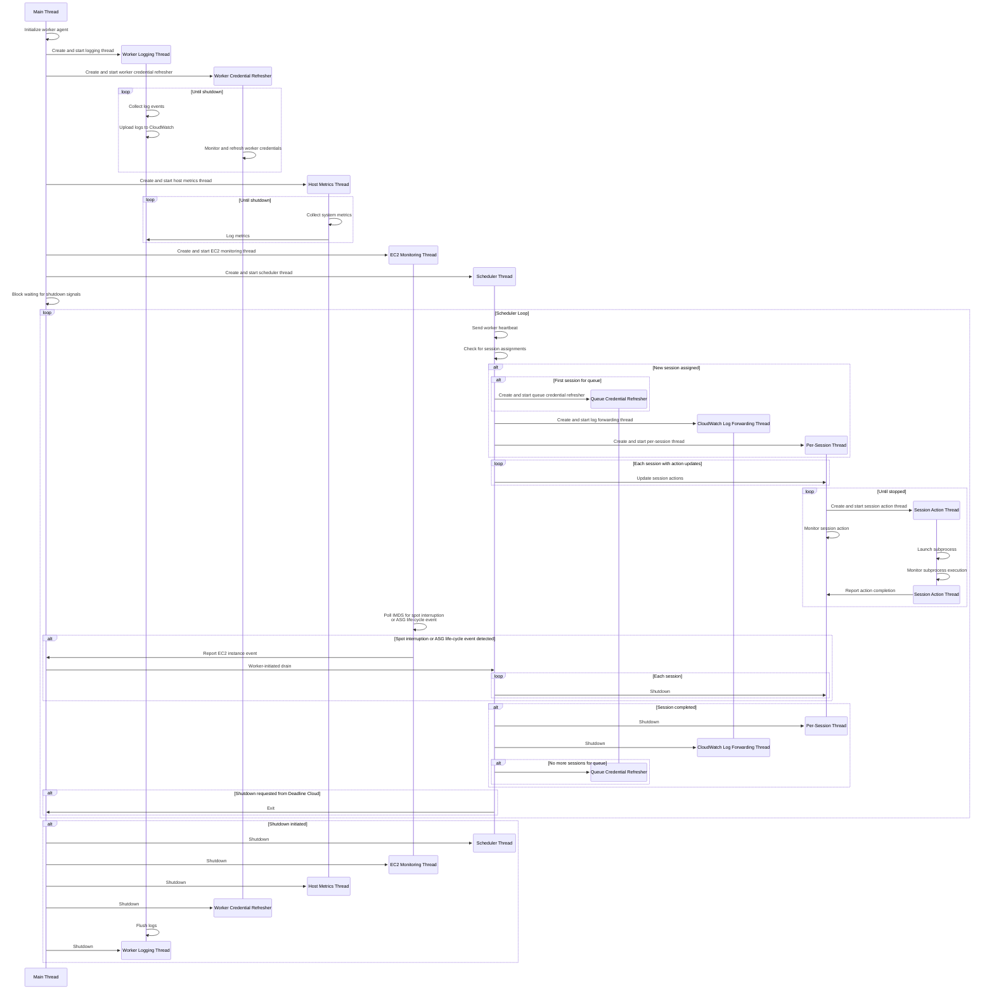

# Worker Agent Architecture

This guide provides developers with a comprehensive overview of the worker agent's architecture, and a breakdown of its components, and the execution model. Whether you're fixing bugs, adding features, or improving performance, understanding the core concepts outlined here will help you understand the architecture of the project.

**Outline:**

*  [1. High-Level Architecture](#1-high-level-architecture)
   *  [1.1. Responsibilities](#11-responsibilities)
*  [2. Software Architecture](#2-software-architecture)
   *  [2.1. Class Diagram](#21-class-diagram)
*  [3. Code Organization](#3-code-organization)
   *  [3.1. Key Files](#31-key-files)
*  [4. Thread Model and Concurrency](#4-thread-model-and-concurrency)
   *  [4.1. Thread Lifecycle Diagram](#41-thread-lifecycle-diagram)
   *  [4.2. Concurrency Control and Locks](#42-concurrency-control-and-locks)
      *  [4.2.1. Lock Acquisition Order](#421-lock-acquisition-order)

## 1. High-Level Architecture

Coming soon&hellip;

### 1.1. Responsibilities

Coming soon&hellip;

## 2. Software Architecture

Coming soon&hellip;

### 2.1. Class Diagram

Coming soon&hellip;

## 3. Code Organization

The worker agent codebase is organized into several key directories:

```
deadline-cloud-worker-agent/
├── src/
│   └── deadline_worker_agent/  # Main source code
│       ├── aws/                # AWS service APIs
│       │   └── deadline/       # AWS Deadline Cloud APIs
│       ├── aws_credentials/    # AWS credentials management
│       ├── boto/               # Boto3 and botocore configuration and shim layer
│       ├── config/             # Configuration handling
│       ├── installer/          # Worker agent installation logic
│       ├── linux/              # Linux-specific code
│       ├── log_sync/           # Log synchronization
│       ├── scheduler/          # Worker scheduler
│       ├── sessions/           # Session management
│       │   ├── actions/        # Session actions
│       │   │   └── scripts/    # Helper scripts for actions
│       │   └── job_entities/   # Job entity handling
│       ├── startup/            # Startup and shutdown phase
│       └── windows/            # Windows-specific code
├── pipeline/                   # CI/CD pipeline scripts
├── scripts/                    # Utility scripts for development and testing
├── tests/
│   ├── e2e/                    # End-to-end tests
│   ├── integration/            # Integration tests
│   └── unit/                   # Unit tests
└── docs/                       # Documentation
```

### 3.1. Key Files

The key source files relative to `src/deadlne_worker_agent/` are:
- `startup/entrypoint.py` &mdash; The main code entrypoint
- `worker.py` &mdash; Contains the `Worker` class which handles OS signals, host metrics logging, EC2 monitoring, and creates/monitors/manages of a `WorkerScheduler` instance.
- `scheduler/scheduler.py` &mdash; Contains the `WorkerScheduler` class responsible for managing the worker's schedule in coordination with the Deadline Cloud service
- `sessions/session.py` &mdash; Contains the `Session` class that manages and individual session's life-cycle

## 4. Thread Model and Concurrency

The worker agent operates using a multi-threaded architecture to efficiently manage concurrent operations:

1. **Main Thread**:
   - Run the worker startup phase (see [the worker lifecycle](./worker_lifecycle.md))
   - Creates a concurrent futures thread pool
   - Creates a future that runs the scheduler loop
   - Blocks waiting for shutdown signals
   - Handles graceful shutdown coordination

2. **Scheduler Thread**:
   - Runs the main scheduler loop
   - Coordinates overall worker operations
   - Handles worker registration and heartbeats
   - Processes session assignments and dispatches them to session threads
   - Manages worker state transitions

3. **Worker Credential Refresher Thread**:
   - Monitors and rotates the worker's IAM credentials before they expire
   - Ensures continuous authentication with AWS services
   - Runs for the entire lifetime of the worker agent

4. **Per-Queue Credential Refresher Threads**:
   - Created when the worker receives a job for a specific queue
   - Manages IAM credentials for queue-specific operations
   - Exists as long as there are sessions assigned to the worker for that queue
   - Terminates when no more sessions for that queue are assigned

5. **Per-Session Threads**:
   - Created for each active session
   - Starts session actions and monitors their execution
   - Reports session progress and status to the service
   - Handles session completion, cancellation, or failure scenarios
   - Manages session-specific resources

6. **Per-Session CloudWatch Log Forwarding Threads**:
   - Created by the scheduler thread before starting each session
   - Forwards session logs to CloudWatch Logs
   - Exists for the lifetime of the session
   - Terminates when the session completes

7. **Session Action Thread**:
   - Created when starting a session action
   - Launches the subprocess for the session action
   - Monitors the subprocess execution
   - Forwards standard output from the subprocess to Python logging events
   - Captures OpenJobDescription standard output protocol events

8. **Logging Thread**:
   - Runs asynchronously to collect log events
   - Batches log entries for efficient transmission
   - Uploads session logs to CloudWatch Logs
   - Handles log buffering and retry logic

9. **Host Metrics Thread**:
   - Periodically collects system metrics (CPU, memory, disk usage)
   - Reports host metrics to the service
   - Helps the service make informed scheduling decisions
   - Runs on a configurable interval

10. **EC2 Monitoring Thread**:
    - Uses Instance Metadata Service (IMDS) to monitor for:
        - EC2 spot interruptions ([docs](https://docs.aws.amazon.com/AWSEC2/latest/UserGuide/spot-interruptions.html))
        - Auto Scaling Group (ASG) lifecycle state changes ([docs](https://docs.aws.amazon.com/autoscaling/ec2/userguide/retrieving-target-lifecycle-state-through-imds.html))
    - Initiates a drain and shutdown when interruptions are detected (see the [worker protocol](worker_lifecycle.md#worker-interruption-sequence))
    - Ensures work can be properly saved and rescheduled when instances are terminated

### 4.1. Thread Lifecycle Diagram

The following sequence diagram illustrates the lifecycle of the various threads in the worker agent:



### 4.2. Concurrency Control and Locks

The worker agent uses locks to ensure thread safety and prevent data race conditions when updating shared state:

1. `WorkerScheduler._action_update_lock`:
   - Global lock for controlling concurrent access to action updates sent to the service
   - Ensures that updates to the service are atomic and consistent
   - Prevents multiple threads from simultaneously modifying the action update queue

2. `Session._current_action_lock`:
   - Session-level lock for controlling concurrent access to the state of the current session action
   - Ensures that only one thread can modify the current action state at a time

#### 4.2.1. Lock Acquisition Order

**⚠️ IMPORTANT:** To avoid deadlocks when a thread needs atomic access to both the `WorkerScheduler`'s data structure for
pending action updates AND a session's current action, the thread must acquire both locks
**in a consistent order**.

The following example demonstrates the correct order of acquiring locks when modifying the data in a critical section.

```python
# Correct lock acquisition order
with (
    # acquire the action update lock first
    worker_scheduler._action_update_lock,

    # acquire the session's current action lock after
    session._current_action_lock,
):
        # Critical section modifying/accessing:

        # a) the session action status updates
        # b) the session's current action state
```
