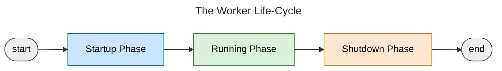
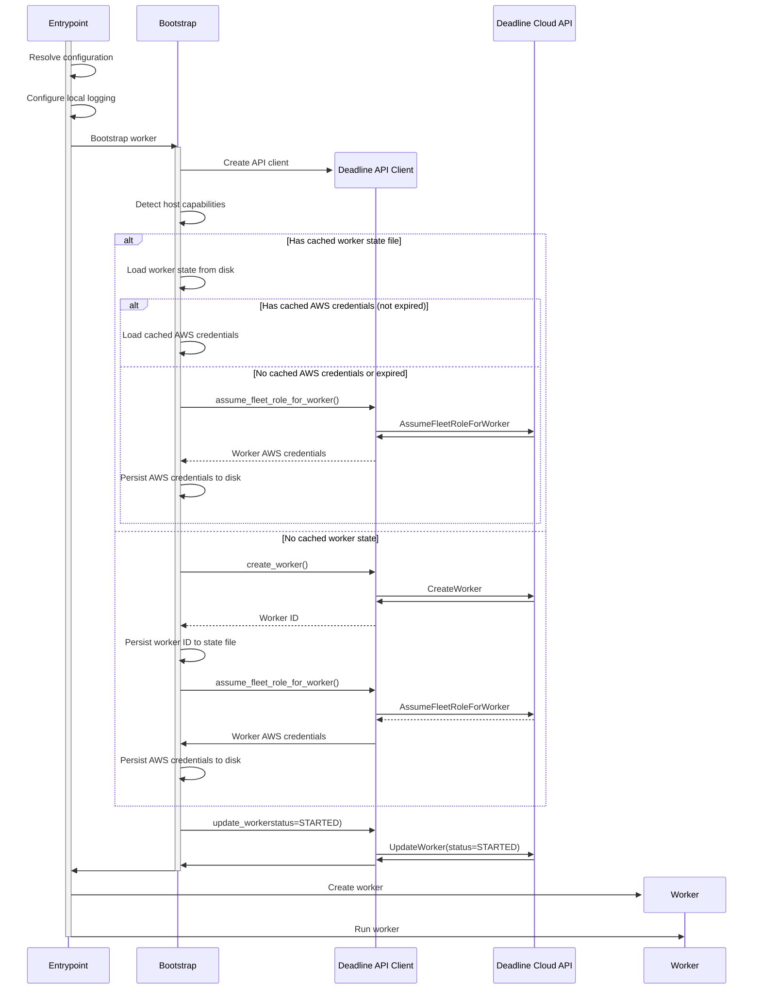

# Worker Agent Lifecycle

This document explains the lifecycle of the AWS Deadline Cloud Worker Agent, including its startup, running, and shutdown phases. Understanding this lifecycle is crucial for developers working on the worker agent codebase.

## Overview

The worker agent goes through three main phases during its lifecycle:

1. **Startup Phase**: Initialization, configuration loading, and worker registration
2. **Running Phase**: Main operational loop, handling sessions and reporting status
3. **Shutdown Phase**: Graceful termination, cleanup, status change, and host shutdown

Each phase involves specific components and operations that ensure the worker agent functions correctly within the AWS Deadline Cloud ecosystem.

## Startup Phase

The startup phase begins when the worker agent process is launched and completes once the worker
is ready to accept sessions. The startup phase consists of:

*   creating a worker resource (if necessary) or determining the existing worker resource
*   ensuring the worker has valid AWS credentials for the worker
*   ensuring the worker is in the `STARTED` status

The diagram below illustrates the startup phase as a flow chart:

The following diagram provides a more detailed look into the sequence of interactions between the various components:

### Key Steps

1.  **Process Initialization**

    The worker agent process starts from:

    -   the `deadline-worker-agent` command-line entrypoint or
    -   a configured operating system service
        -   a systemd service unit on Linux
        -   a Windows Service on Windows

    The `deadline-worker-agent` command runs the `entrypoint` function located in the
    `startup/entrypoint.py` file.

2.  **Configuration Loading**

    Configuration is resolved using a combination of command-line arguments, environment variables,
    and a config file (see the [user config documentation](../configuration.md)).

    The `Configuration` class in `config/config.py` handles the loading and validation.

3.  **Worker Bootstrap**

    -   The `bootstrap_worker` function in `startup/bootstrap.py` handles worker creation
    -   Host capabilities are collected (OS, vCPU count, system memory, GPU count, etc&hellip;)
    -   The [worker state file](../state.md#worker-state-file) is checked for existing worker information

        **If a worker state file exists:**

        -   The worker ID is loaded from the state file
        -   Cached AWS credentials are checked for validity
        -   If valid credentials exist, they are used to initialize the worker
        -   If credentials are missing or expired, new credentials are obtained by making an
            `AssumeFleetRoleForWorker` API request and persisting them to disk

        **If no worker state file exists:**

        -   A new worker is registered with the AWS Deadline Cloud service by making a `CreateWorker`
            API request
        -   The worker ID is persisted to the state file
        -   Worker credentials are obtained via `AssumeFleetRoleForWorker` and persisted to disk

    -   After obtaining credentials, the Worker status is updated to `STARTED` by making an
        `UpdateWorker` API request

4.  **Worker Initialization**
    -   The `Worker` class is instantiated with valid worker IAM credentials and the worker ID in
        the `STARTED` status
    -   The `Worker.run()` method is called which is the transition into the **Running** phase

## Running Phase

Coming soon&hellip;

## Shutdown Phase

Coming soon&hellip;

## Next Steps

After understanding the worker agent lifecycle, we recommend exploring:

- [Session Lifecycle](session_lifecycle.md) - Comprehensive overview of how sessions are executed
- [Architecture](architecture.md) - Overview of the worker agent architecture and components
- [Worker API Protocol](worker_api_protocol.md) - Documentation of the API interactions with the Deadline Cloud service
