# Worker Agent Lifecycle

This document explains the lifecycle of the AWS Deadline Cloud Worker Agent, including its startup, running, and shutdown phases. Understanding this lifecycle is crucial for developers working on the worker agent codebase.

## Overview

The worker agent goes through three main phases during its lifecycle:

1. **Startup Phase**: Initialization, configuration loading, and worker registration
2. **Running Phase**: Main operational loop, handling sessions and reporting status
3. **Shutdown Phase**: Graceful termination, cleanup, status change, and host shutdown

Each phase involves specific components and operations that ensure the worker agent functions correctly within the AWS Deadline Cloud ecosystem.

## Startup Phase

The startup phase begins when the worker agent process is launched and completes once the worker
is ready to accept sessions. The startup phase consists of:

*   creating a worker resource (if necessary) or determining the existing worker resource
*   ensuring the worker has valid AWS credentials for the worker
*   ensuring the worker is in the `STARTED` status

The diagram below illustrates the startup phase as a flow chart:

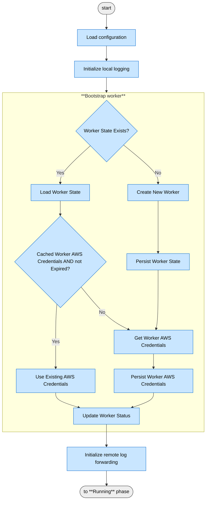

The following diagram provides a more detailed look into the sequence of interactions between the various components:

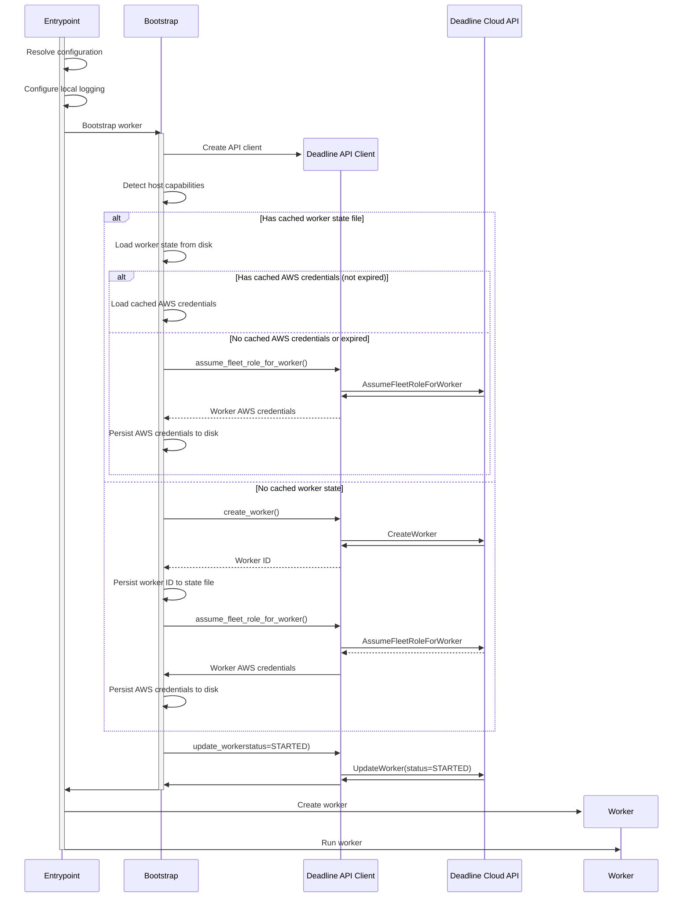

### Key Steps

1.  **Process Initialization**

    The worker agent process starts from:

    -   the `deadline-worker-agent` command-line entrypoint or
    -   a configured operating system service
        -   a systemd service unit on Linux
        -   a Windows Service on Windows

    The `deadline-worker-agent` command runs the `entrypoint` function located in the
    `startup/entrypoint.py` file.

2.  **Configuration Loading**

    Configuration is resolved using a combination of command-line arguments, environment variables,
    and a config file (see the [user config documentation](../configuration.md)).

    The `Configuration` class in `config/config.py` handles the loading and validation.

3.  **Worker Bootstrap**

    -   The `bootstrap_worker` function in `startup/bootstrap.py` handles worker creation
    -   Host capabilities are collected (OS, vCPU count, system memory, GPU count, etc&hellip;)
    -   The [worker state file](../state.md#worker-state-file) is checked for existing worker information

        **If a worker state file exists:**

        -   The worker ID is loaded from the state file
        -   Cached AWS credentials are checked for validity
        -   If valid credentials exist, they are used to initialize the worker
        -   If credentials are missing or expired, new credentials are obtained by making an
            `AssumeFleetRoleForWorker` API request and persisting them to disk

        **If no worker state file exists:**

        -   A new worker is registered with the AWS Deadline Cloud service by making a `CreateWorker`
            API request
        -   The worker ID is persisted to the state file
        -   Worker credentials are obtained via `AssumeFleetRoleForWorker` and persisted to disk

    -   After obtaining credentials, the Worker status is updated to `STARTED` by making an
        `UpdateWorker` API request

4.  **Worker Initialization**
    -   The `Worker` class is instantiated with valid worker IAM credentials and the worker ID in
        the `STARTED` status
    -   The `Worker.run()` method is called which is the transition into the **Running** phase

## Running Phase

The running phase is the main operational phase of the worker life-cycle. In this phase, the worker
agent:

*   processes sessions
*   synchronizes the worker's assigned schedule and reports status/progress with the AWS Deadline
    Cloud service

The `Worker` class serves as the central coordinator for multiple long-running components.

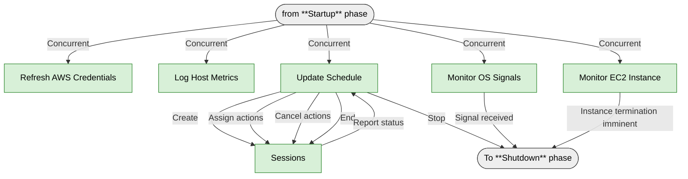

### Worker Components

The `Worker` class manages several key components that run concurrently:

1. **AWS Credentials Refresher**
   - Implemented in the `AwsCredentialsRefresher` class
   - Rotates the worker credentials by periodically invoking the `AssumeFleetRoleForWorker` API
   - Ensures the worker always has valid credentials for API calls
   - Persists refreshed credentials to disk for recovery scenarios

2. **Host Metrics Logger**
   - Samples host metrics such as CPU, memory, and disk usage
   - Logs these metrics at regular intervals
   - Provides visibility into worker resource utilization
   - Helps identify performance bottlenecks or resource constraints

3. **Worker Scheduler**
   - Responsible for scheduling worker sessions through `UpdateWorkerSchedule` API requests
   - Manages the lifecycle of sessions assigned to the worker
   - Creates and terminates session objects as needed
   - Reports session status and progress to the Deadline Cloud API

4. **OS Signal Handlers**
   - Traps operating system signals (`SIGTERM`, `SIGINT`, etc.)
   - Initiates graceful worker drains when signals are received
   - Ensures proper cleanup of resources during shutdown
   - Prevents abrupt termination of active sessions

5. **EC2 Instance Monitoring**
   - Active when running on EC2 and [Instance Metadata Service (IMDS)][imds] is available
   - Polls IMDS to monitor for upcoming spot instance interruptions
   - Polls IMDS to monitor for upcoming Auto Scaling Group (ASG) lifecycle events
   - Initiates worker-initiated drains when termination events are detected
   - Provides graceful handling of cloud infrastructure events

### New Session Assignment

The `WorkerScheduler` class is responsible for periodically making `UpdateWorkerSchedule` API
requests to Deadline Cloud. The API response includes a list of currently assigned sessions. When
the worker observes a newly assigned session, the `WorkerScheduler` initiates the following sequence
of actions to setup the new session:

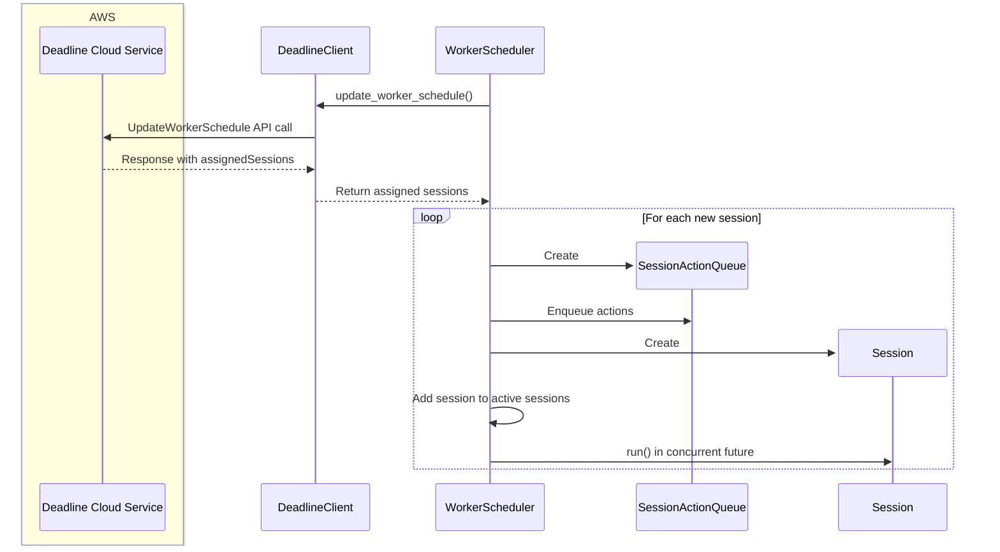

### Session Action Initiation

As seen in the **New Session Assignment** section above, the scheduler creates a new thread for each
session. This thread has the following responsibilities:

*   If the session is not currently running any action, attempt to dequeue the next action from the
    session's `SessionActionQueue` and initiate it.
    
*   Monitor for a signal from the scheduler's thread that the session has completed.
    *   If so, exit the loop

This diagram illustrates how a session action is dequeued and initiated:

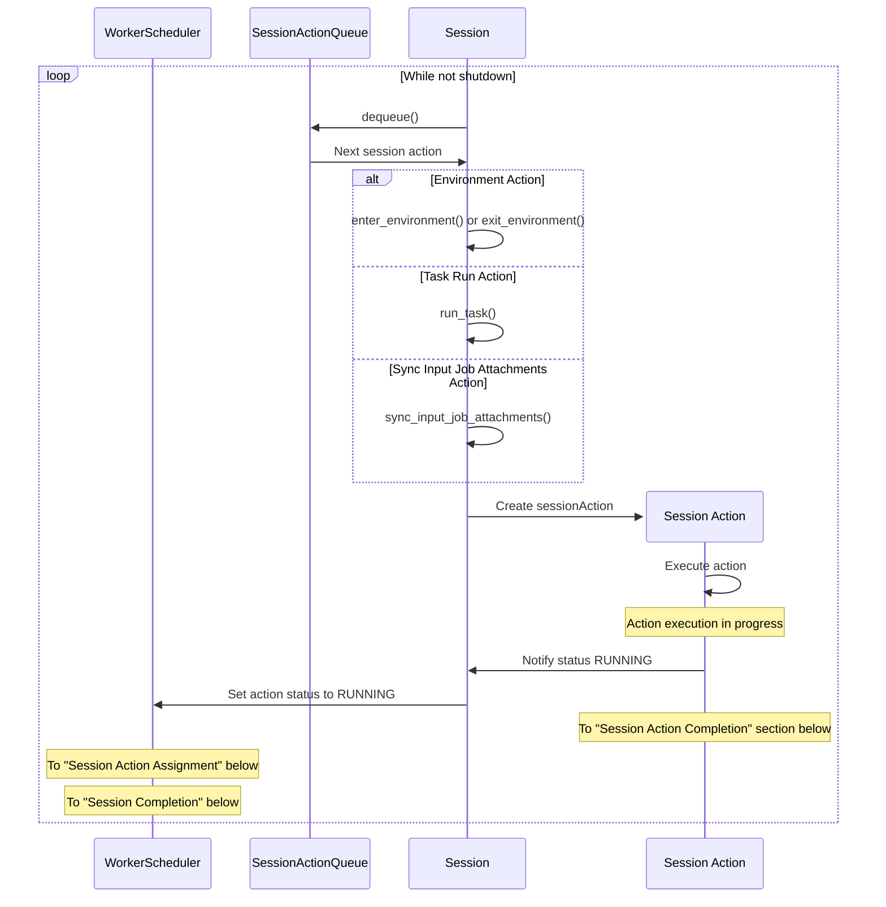

### Session Action Completion

This diagram shows what happens when a session action completes:

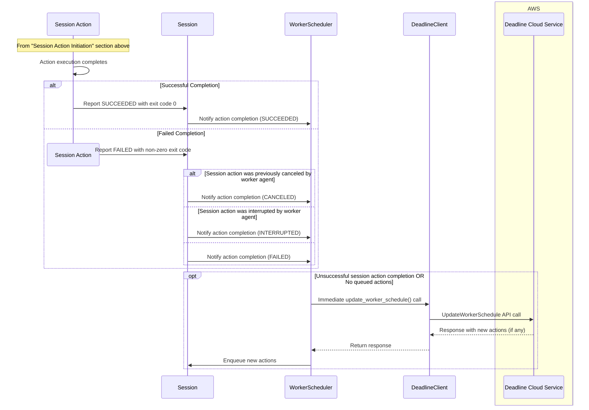

### Session Action Assignment

This diagram shows how updates to the session actions assigned by the Deadline Cloud service are dispatched from the `WorkerScheduler` to the `Session` and then to the `SessionActionqueue`. This happens each time the scheduler receives an `UpdateWorkerSchedule` API response. The response can include a mix of previously assigned session actions (no action), new session actions, and session action cancelation (see next section):

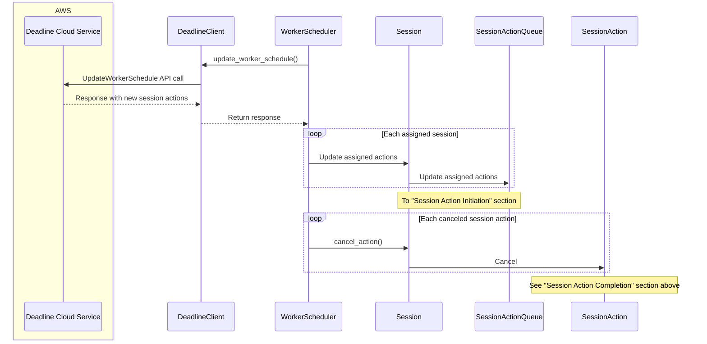

### Session Completion

This diagram shows what happens when a session is terminated because it no longer appears in the UpdateWorkerSchedule response:

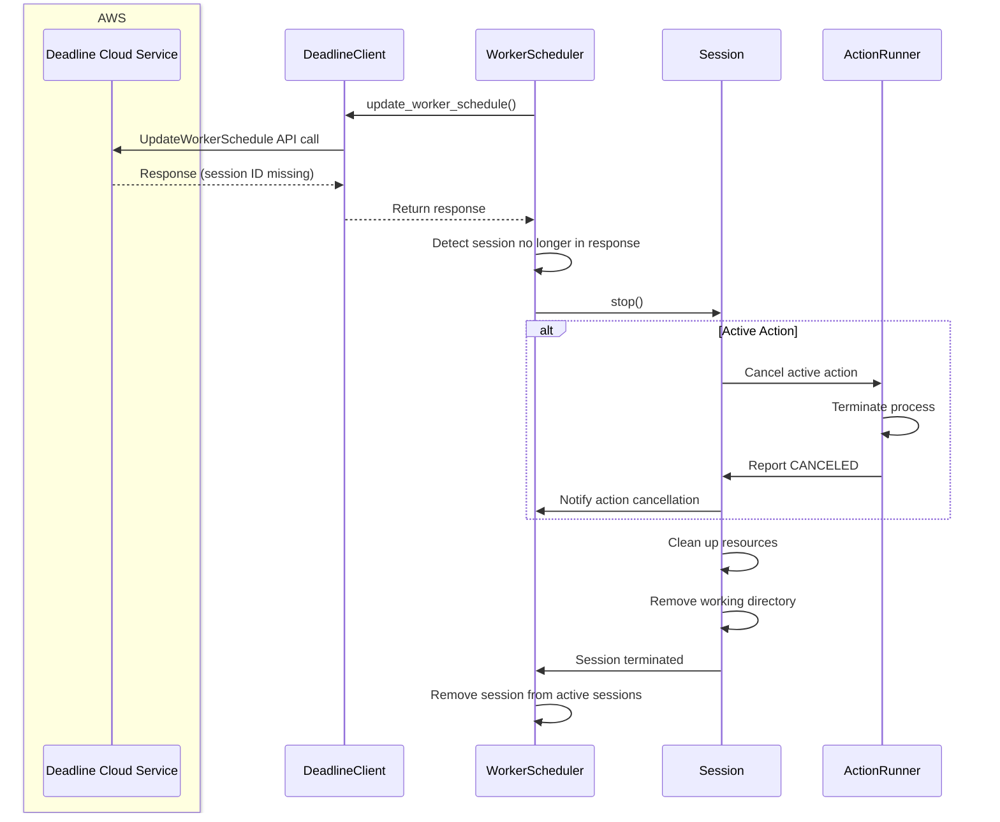

### Worker Interruption

This diagram shows what happens when the worker agent is interrupted by either an operating system
signal (`SIGTERM` on Linux, `CTRL_BREAK` or service stoppage on Windows), an EC2 spot interruption,
or an EC2 auto-scaling lifecycle status change.

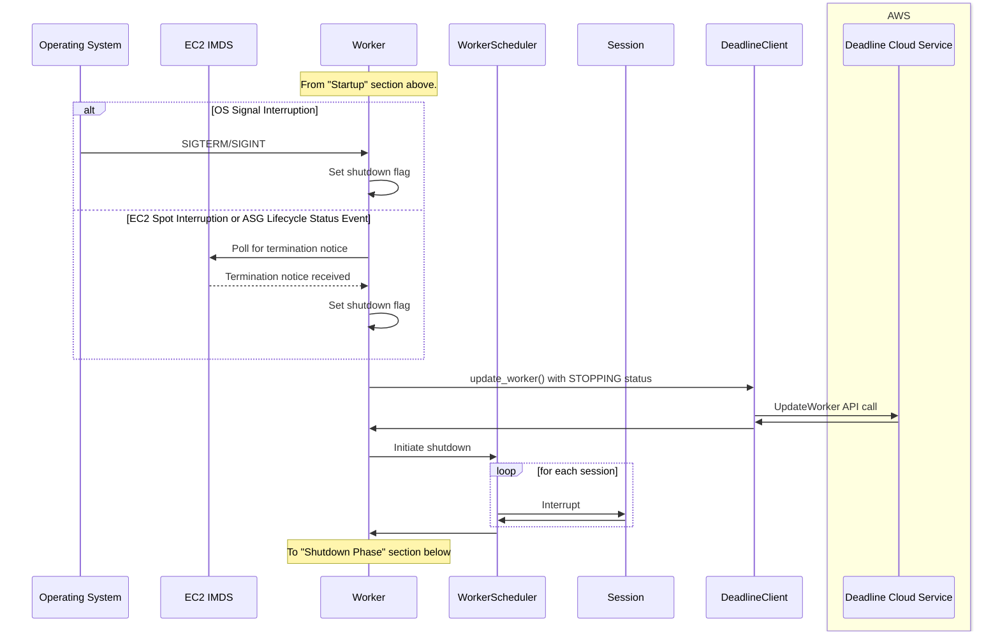

### Service-Initiated Shutdown

When a worker is part of a service-managed fleet (SMF) or an auto-scaling customer-managed fleet (CMF), the service may determine that the worker is no longer necessary based on auto-scaling decisions. In this case, the worker receives a signal to shut down its host through the `UpdateWorkerSchedule` API response.

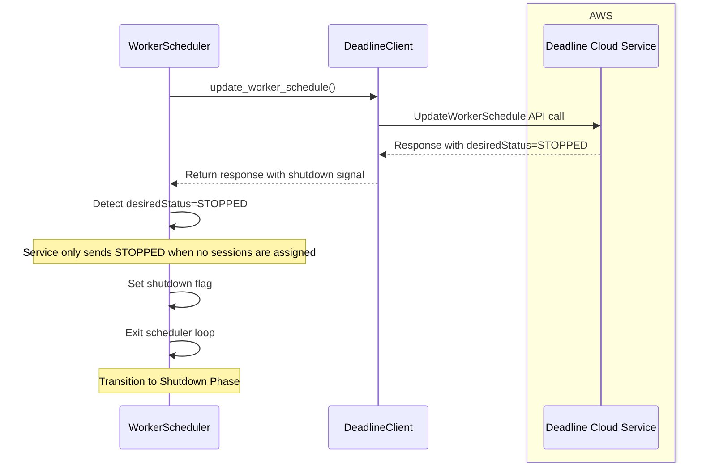

Key aspects of service-initiated shutdown:

1.  **Shutdown Signal Detection**
    -   The worker receives an `UpdateWorkerSchedule` response with `desiredStatus=STOPPED`
    -   This indicates the service has determined the worker should be terminated

2.  **Preconditions**
    -   The service only sends the shutdown signal when there are no remaining sessions assigned to the worker
    -   This ensures no work is interrupted by the shutdown

3.  **Graceful Termination**
    -   Upon receiving the shutdown signal, the worker initiates its normal shutdown sequence
    -   If the worker agent is configured to shutdown the host, it will:
        -   The worker updates its status to `STOPPING`
        -   Repeatedly attempt to shutdown the host machine
    -   Otherwise, the worker updates its status to `STOPPED`
    -   All resources are properly cleaned up before the process exits

4.  **Auto-scaling Integration**
    -   For SMFs, this allows AWS to manage the fleet size automatically
    -   For auto-scaling CMFs, this enables dynamic scaling based on workload demands
    -   The worker agent cooperates with the service to ensure smooth scaling operations

This service-initiated shutdown mechanism enables efficient resource utilization by allowing the service to scale down worker capacity when it's not needed, while ensuring that no work is interrupted in the process.

### Key Components and Operations

1.  **Worker Heartbeat**

    The worker must regularly "hearbeat" to the service. This heartbeat is through regular
    `UpdateWorkerSchedule` API requests to the worker. The worker must make requests within the
    polling interval returned in the `updateIntervalSeconds` response field of the
    `UpdateWorkerSchedule` API.

2.  **Session Assignment**
    -   The worker polls for session assignments using the  `UpdateWorkerSchedule` API
    -   Polling frequency is controlled by `updateIntervalSeconds` returned by the service
    -   When a session is assigned, the worker creates a `Session` object
    -   Job entities required for running sessions are retrieved from the service using the
        `BatchGetJobEntity` API

3.  **Session Execution**
    -   Sessions are executed through the `Session.run()` method
    -   Each session creates a number of threads in the worker agent
        -   One for initiating actions
        -   One for running the current session action
        -   One for uploading logs to CloudWatch
    -   Progress and status are reported to the service via the `WorkerScheduler`
    -   Immediate `UpdateWorkerSchedule` calls are made for failed actions or when no actions are queued
    -   For successful actions with queued actions, the worker continues processing without an immediate API call

4.  **EC2 Shutdown Monitoring**
    -   The worker monitors for notifications of upcoming EC2 instance termination by polling EC2 [Instance Metadata Service (IMDS)][imds].
        Notifications polled include:
        -   EC2 spot interruptions
        -   Auto-scaling lifecycle status events
    -   The `Worker._monitor_ec2_shutdown()` method handles this monitoring in its own thread

[imds]: https://docs.aws.amazon.com/AWSEC2/latest/UserGuide/ec2-instance-metadata.html

5.  **Error Handling**
    -   Transient API errors (429, 5xx) are retried with exponential backoff
    -   Unrecoverable errors cause the worker agent to drain its running sessions and exit
        the program
    -   Session failures are handled gracefully and the worker reports them through
        `UpdateWorkerSchedule`

## Shutdown Phase

The shutdown phase begins when the worker agent receives a termination signal (either worker-initiated or service-initiated) and ends when the process exits.

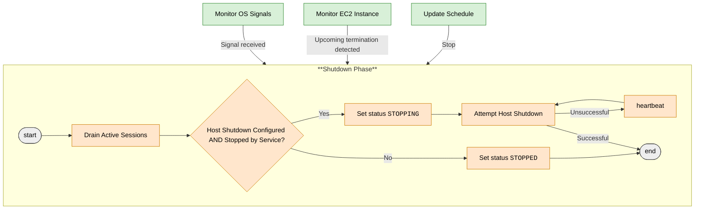

The following diagram provides a more detailed look into the sequence of interactions between the various components:

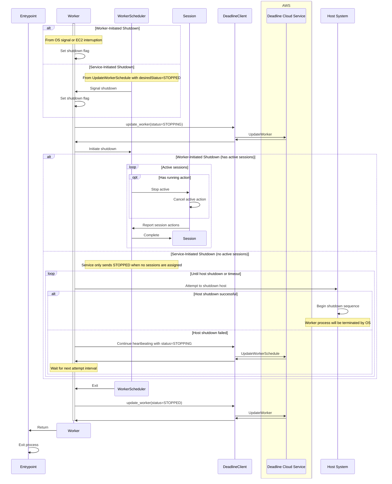

### Key Steps

1.  **Shutdown Initiation**
    -   Worker-initiated: Triggered by one of the following (see **Running Phase** section above):
        -   OS signals (`SIGTERM` / `SIGINT`)
        -   EC2 Spot interruption notices from IMDS
        -   Auto Scaling Group (ASG) lifecycle events
    -   Service-initiated: Triggered by `UpdateWorkerSchedule` response with `desiredStatus=STOPPED`

2.  **Worker State Update**
    -   The worker makes an `UpdateWorker` API request to change the worker status:
    -   For service-initiated shutdowns, the worker status is is set to `STOPPING`
    -   For worker-initiated shutdowns, the worker status is is set to `STOPPED`

3.  **Session Handling**
    -   For worker-initiated shutdown: Active sessions are identified and stopped using
        `Session.stop()`. If there is a running action, it is canceled and an immediate
        `UpdateWorkerSchedule` API request is made reporting the action with `completedStatus` of
        `INTERRUPTED`.
    -   For service-initiated shutdown: No active sessions should be present (service precondition)

4.  **Resource Cleanup**
    -   Temporary files and directories are cleaned up
    -   Thread pools are shut down

5.  **Host Shutdown Attempts (Service-Initiated Only)**
    -   The worker attempts to shut down the host machine
    -   If successful, the OS will terminate the worker process as part of the shutdown sequence
    -   If unsuccessful, the worker continues to:
        -   Maintain `STOPPING` status
        -   Heartbeat to the service using an `UpdateWorkerSchedule` API request
        -   Periodically retry the host shutdown
   -    This continues until either the host shuts down or a timeout is reached

6. **Process Termination**
   
   The worker agent process exits with an appropriate exit code depending on the circumstance
   for program termination:

    -   `0` &mdash; for successful exit. This can happen if
        -   The worker agent was ran interactively and a keyboard interrupt (e.g. `CTRL` + `C` on Linux)
            caused the worker agent to exit.
        -   The worker agent detected an upcoming EC2 spot interruption or auto-scaling group
            life-cycle status event change and exited 
    -   Non-zero &mdash; for "unsuccessful" exits. This can happen if:
        -   The worker encountered an unhandled exception
        -   The worker was shutdown by an OS signal
            -   This includes when the worker agent shuts down the host. The operating system will
                send a signal to the process.

## Next Steps

After understanding the worker agent lifecycle, we recommend exploring:

-   [Session Lifecycle](session_lifecycle.md) - Comprehensive overview of how sessions are executed
-   [Architecture](architecture.md) - Overview of the worker agent architecture and components
-   [Worker API Protocol](worker_api_protocol.md) - Documentation of the API interactions with the Deadline Cloud service
